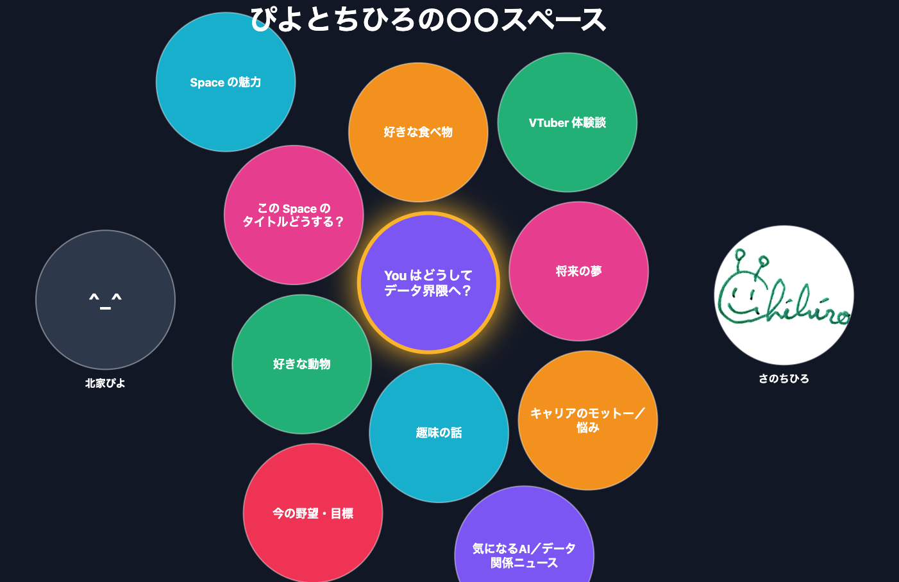
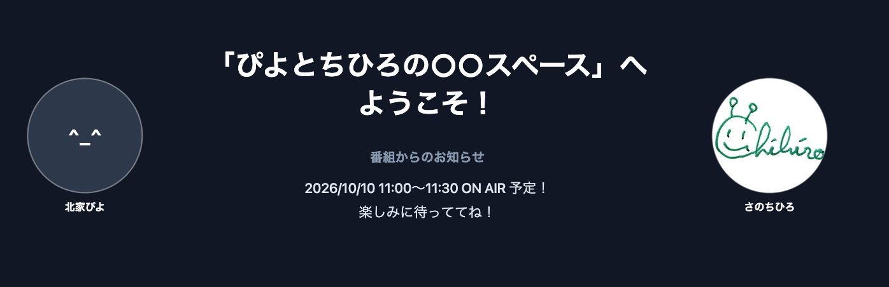
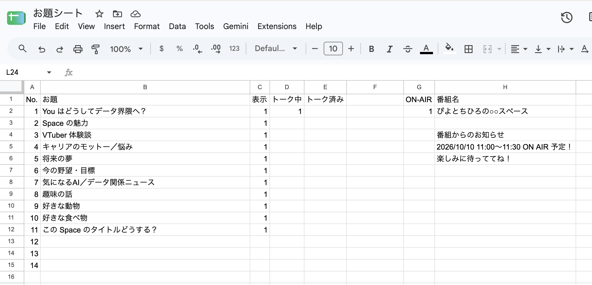

# トーク番組のお題決めアプリ

「ぴよとちひろの○○」Spaceの運営用に開発したアプリです。
2人のスピーカーで、話題を選びながらトークするようなトーク番組の運営に特化したアプリです。

## アプリがやっていること

### ON-AIR中



- Google Spreadsheet からお題一覧を取得
- 今トーク中の話題は、スポットライトが当たって真ん中にいく
- そのテーマのトークが終わると、話題のまるが消える

### ON-AIR中以外



- 番組タイトルと番組からのお知らせを表示

## 使い方

### Google Spreadsheet

- 番組名、番組からのお知らせ、お題、状態（お題の状態＆ON-AIR状態）はすべて Google Spreadsheetで管理しています。
- 番組のホストが Google Spreadsheet を手動で管理・更新しながら番組を進める想定です。

#### シートの中身



- お題一覧 - C列が1かつE列が1以外のお題を画面表示。D列が1のお題はスポットライトが当たってセンターにいく
  - A列 = 通番
  - B列 = お題の候補
  - C列 = そのお題を画面表示するかのフラグ
  - D列 = トーク中かどうかのフラグ
  - E列 = トーク済みフラグ
- G2セル = 1なら ON-AIR 中、それ以外は NOT ON-AIR
- H2セル = 番組名
- H5セル〜 = 番組からのお知らせ。ON-AIR中以外の画面に表示。（1行ごとに改行し、空行出現時点で表示ストップ）

### デプロイ方法

- Cloudflare の Page としてデプロイしています。
- 環境変数に以下を設定。
   - `SPREADSHEET_ID`（必須） : Google Spreadsheet のID　（ `https://docs.google.com/spreadsheets/d/{この部分だよ！}/edit?gid=0#gid=0` ）
   - `SPEAKER1_NAME` / `SPEAKER2_NAME` : 画面表示用のスピーカー名
   - `SPEAKER1_ICON_PATH` / `SPEAKER2_ICON_PATH`（任意）: スピーカーのアイコン画像のパス 
   - 画像のパスは、Google Drive に入れた場合は `https://drive.google.com/uc?id={ここにIDを指定}）` のように指定する。
- Google Spreadsheet は、リンクを知っている全員が参照できる権限をつけておく必要あり。
- `SPEAKER1_ICON_PATH` / `SPEAKER1_ICON_PATH` に Google Drive に格納した画像を指定する場合も同様。

## ローカル開発

毎回 Cloudflare にデプロイしないと表示や挙動が確認できないのは面倒。なのでローカルでもテストできるようにしてあります。
本番に近い形（静的ファイル + `/api/sheets`）で確認するため、 **Wrangler** を使います。開発サーバーは **http://localhost:8788** で動きます。

`.dev.vars.example` をコピーして　`.dev.vars` ファイルをプロジェクト直下に作り、変数の値を設定してください。

### ローカルサーバーの起動（初回だけ）

```bash
npm install
cp .dev.vars.example .dev.vars
```

### ローカルサーバーの起動

```bash
npm run dev
```

Wrangler の対話メニューが出たら、そのターミナルは dev サーバー専用にしておきます（`[x]` で終了、`[b]` でブラウザを開く、など）。

---

### dev サーバーを止めて再起動する

`.dev.vars` の変更や `functions/api/sheets.js`・`index.html` の反映確認のときは、**一度止めてから** 起動し直します。`.dev.vars` は起動時にだけ読み込まれます。

### 1. 止める

`npm run dev` を実行しているターミナルで:

- **Ctrl+C** を押す  
  または
- メニュー表示中なら **`x`** で終了

プロンプト（`➜ piyochihi` など）に戻れば停止できています。

### 2. 起動し直す

同じプロジェクトディレクトリで:

```bash
npm run dev
```

### 3. ブラウザを更新

**http://localhost:8788** をリロードします。

---
